# Automated-Essay-Scoring: Model Deployment and Monitoring on Kubernetes
## Contents
- [Introduction](#introduction)
- [API Deployment on Azure Kubernetes](#api-deployment-on-azure-kubernetes)
- [CI/CD Pipeline with Jenkins](#cicd-pipeline-with-jenkins)
- [Monitoring](#monitoring)

## Introduction

This project is an NLP-based Automated Essay Scoring system that leverages various cutting-edge technologies to provide a comprehensive solution for automatic grading. The key components and technologies used in this project include:

- **Git/GitHub**: Version control and collaboration.
- **Modeling**: Utilizes Hugging Face and Kaggle for training and fine-tuning NLP models.
- **Docker**: Containerization of the application for consistency across environments.
- **FastAPI**: A high-performance API framework used for building the essay scoring API.
- **Locust**: Load testing tool to ensure the API can handle high traffic.
- **Kubernetes (K8s) & Helm**: Service deployment and management, with NGINX Ingress for routing traffic.
- **CI/CD with Jenkins**: Automates the build, test, and deployment pipeline to streamline development.
- **Monitoring**: Integrates Elasticsearch, Filebeat, Kibana, Prometheus, and Grafana for logging, metrics collection, and visualization.
- **Cloud Platform**: Microsoft Azure for deploying and managing cloud infrastructure.
- **Infrastructure as Code**: Ansible and Terraform are used for provisioning and managing infrastructure.
- **Pre-trained Model**: Microsoft DeBERTa v3 small model serves as the foundation for essay scoring.

### Project Structure
```bash
Automated-Essay-Scoring
    ├── deployments
    │   ├── ess
    │   └── nginx-ingress
    ├── Dockerfile
    ├── elk
    │   ├── elastic-elasticsearch
    │   ├── elastic-filebeat
    │   └── elastic-kibana
    ├── iac
    │   ├── ansible
    │   └── terraform
    ├── jenkins
    │   ├── docker-compose.yaml
    │   ├── Dockerfile
    │   └── README.md
    ├── Jenkinsfile
    ├── locustfile.py
    ├── main.py
    ├── models
    │   └── model_weighted_training
    ├── notebooks
    │   ├── notebook_normal_tranning.ipynb
    │   └── notebook_weighted_tranning.ipynb
    ├── prometheus
    │   ├── kube-prometheus-stack
    │   ├── kube-prometheus-stack-62.3.1.tgz
    │   └── values-prometheus.yaml
    ├── README.md
    ├── request.py
    ├── requirements.txt
    └── tests
        └── test_model_correctness.py
```

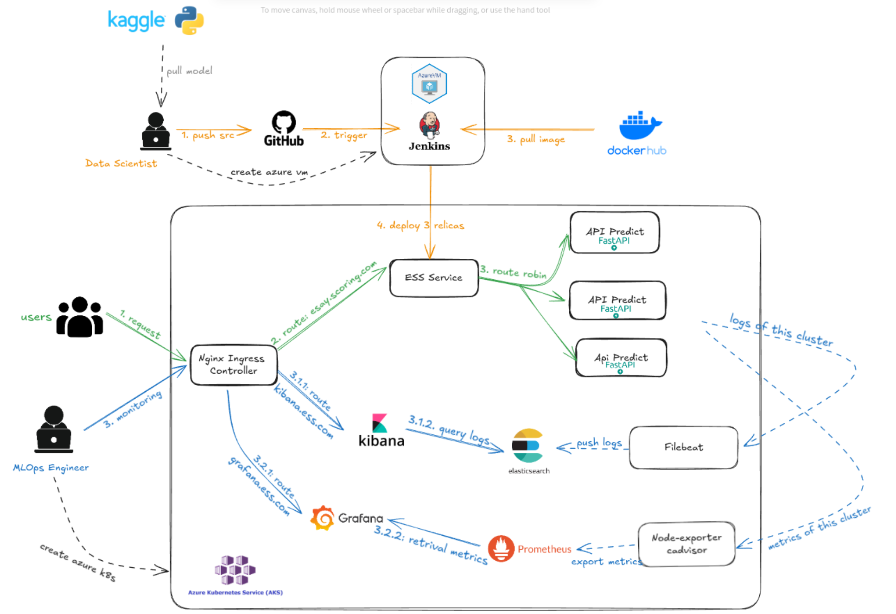

## API Deployment on Azure Kubernetes
### 1. Create Azure Kubernetes Service using Terrafrom
#### 1.1. Install Azure CLI and Login to Azure 
```bash
curl -sL https://aka.ms/InstallAzureCLIDeb | sudo bash
az login
```
#### 1.2. Create Azure K8s
Modify the `main.tf` and `variables.tf` files in the `terraform` directory to specify the configuration settings that best suit your needs. This may include resource group names, location, Kubernetes version, and node count.
```bash
cd iac/terraform
terraform init
terraform plan
terraform apply
```
#### 1.3. Connect to Cluster 
Open cluster in portal azure and connect
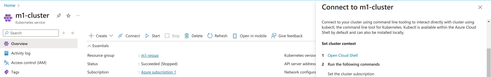
#### 1.4. Switch to this cluster 
Step 1 : Install kubectx `brew install kubectx`

Step 2 : `kubectx <cluster_name>`

### 2. Deploy Model Serving 
#### 2.1. Deploy model
```bash
kubectl create ns model-serving
kubens model-serving
cd deployments/ess
helm upgrade --install ess .
```
#### 2.2. Deploy NGINX-ingress
```bash
kubectl create ns nginx-system
kubens nginx-system
cd deployments/nginx-ingress
helm upgrade --install nginx-ingress .
```
#### 2.3. Mapping ingress hostname to IngressController IP
`sudo vim /etc/hosts`
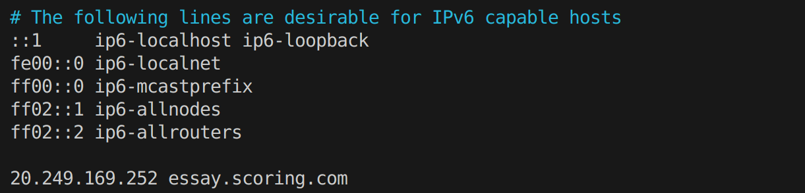

Then, we can access Swagger UI of FastAPI to use model inference
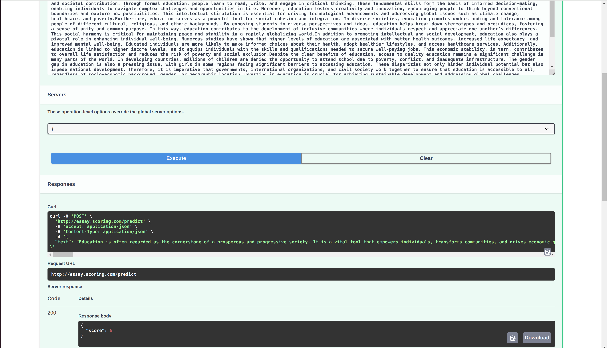

## CI/CD Pipeline with Jenkins
### 1. Create Azure Virtual Machine
```bash
cd iac/ansible
ansible-playbook main.yml
ssh azureuser@<ip_address> -i /home/azureuser/.ssh/authorized_keys/id_rsa
```
After connect to VM, install docker for VM
### 2. Config Jenkins
We can view `username` and `password` of Jenkins when run command: `docker logs jenkins`
Config jenkins following:
- Get server : Run commnad `cat /home/<admin>/.kube/config`
  
- Open `Cloud` component on jenkins to connect my cluster
  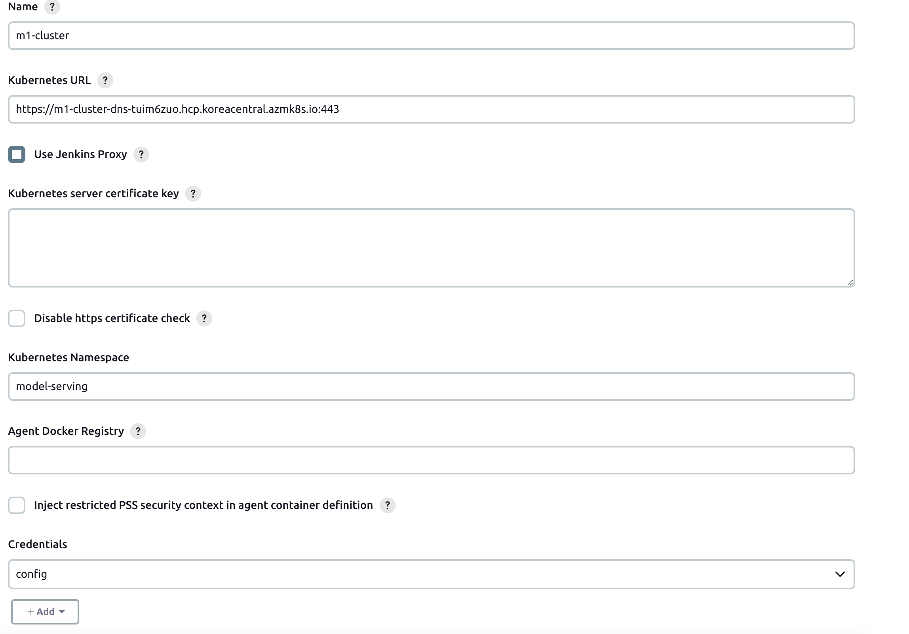
- Add credential by the config file above
  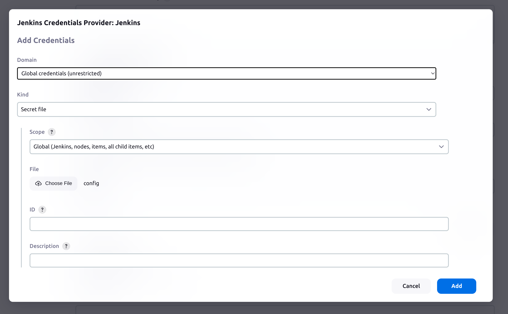
### 3. Create and Config Multibranch Pipeline Item
- Add credential
  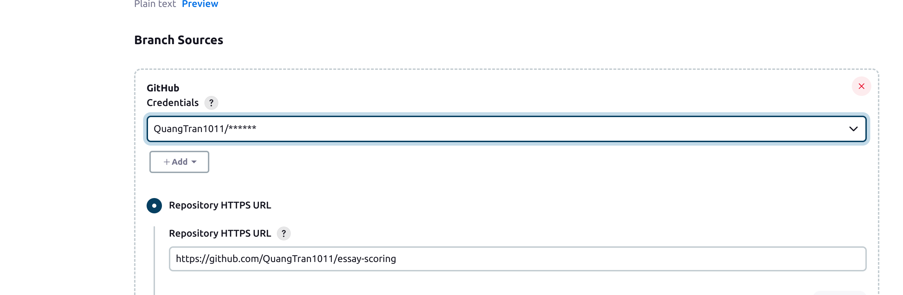
  with password is github accesstoken
  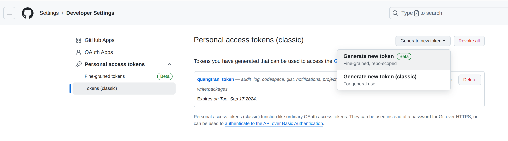
- Add Webhook on github
  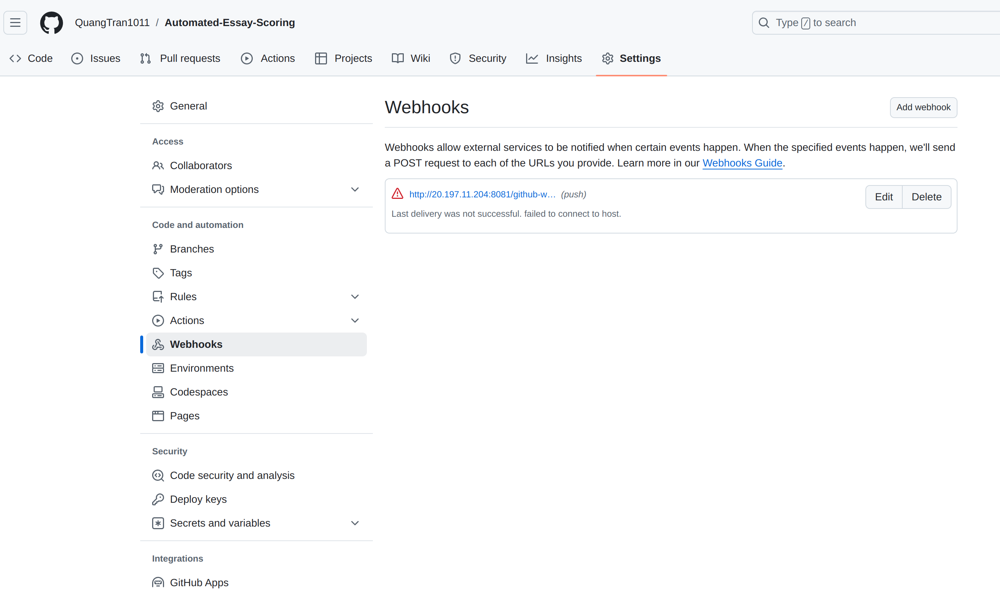
- Run Build item and this is the results:
  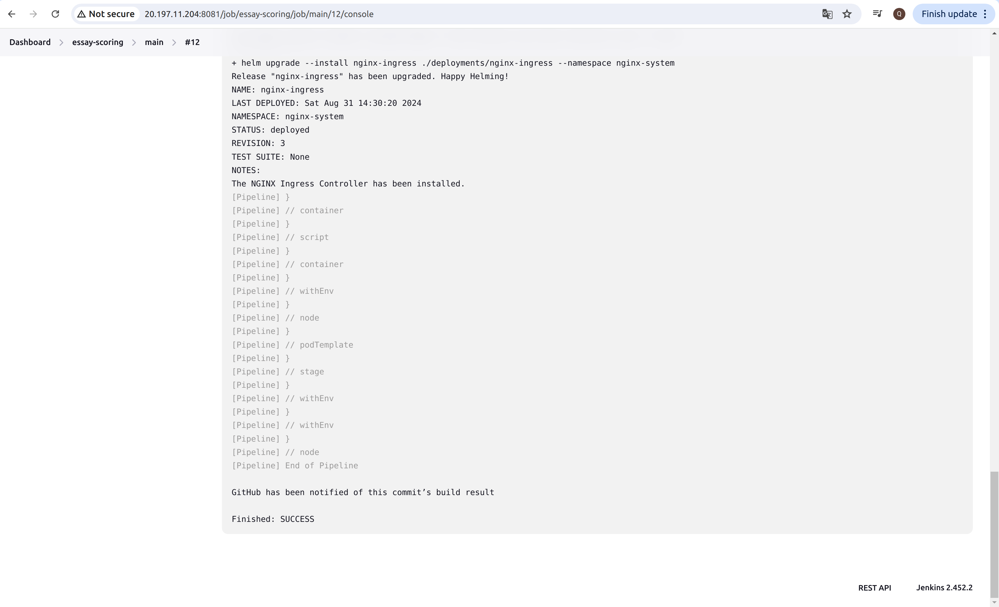

## Monitoring
### 1. Monitoring Logs using ELK Stack
#### 1.1. Install Elasticsearch
- Run command:  
```bash
cd elk/elastic-elasticsearch
helm -n model-serving install elasticsearch -f value-elasticsearch.yaml elasticsearch
```
#### 1.2. Install Kibana
- Run command:  
```bash
cd elk/elastic-kibana
helm -n model-serving install kibana -f value-kibana.yaml kibana
```
- Mapping Ingress Hostname to the IP similar as model deployment:
`20.249.169.252 kibana.ess.com`
#### 1.3. Install Filebeat
- Run command:  
```bash
cd elk/elastic-filebeat
helm -n model-serving install filebeat -f value-filebeat.yaml filebeat
```
#### 1.4. Access Kibana via Hostname:kibana.ess.com
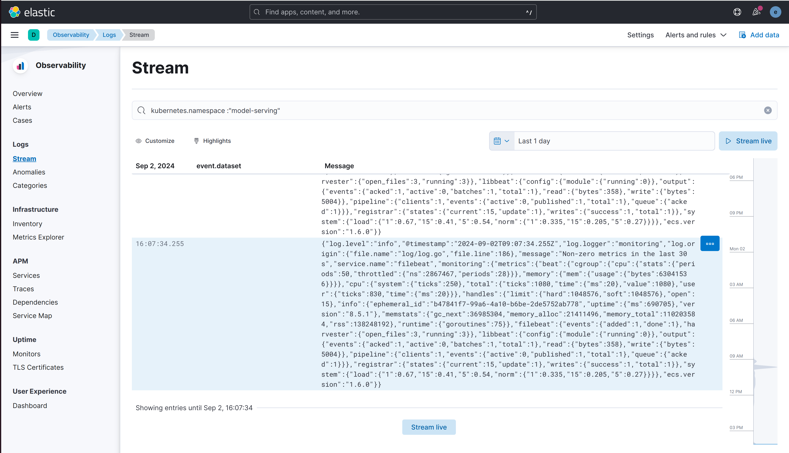
### 2. Monitoring Metrics using Porometheus and Grafana
#### 1.1. Install Prometheus-Grafana
- Run command:
```bash
cd prometheus
helm -n model-serving install prometheus-grafana-stack -f values-prometheus.yaml kube-prometheus-stack
```
- Mapping Ingress Hostname to the IP similar as model deployment:
```bash
20.249.169.252 prometheus.ess.com
20.249.169.252 grafana.ess.com
20.249.169.252 alertmanager.ess.com
```
#### 1.2. Access Prometheus and Kibana via Hostname
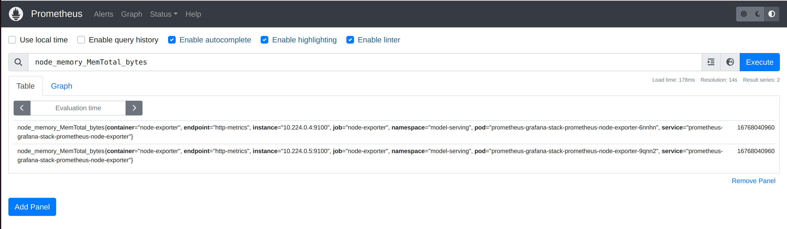
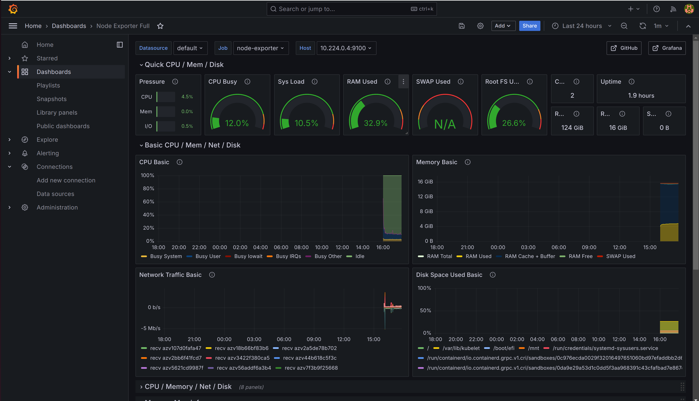
